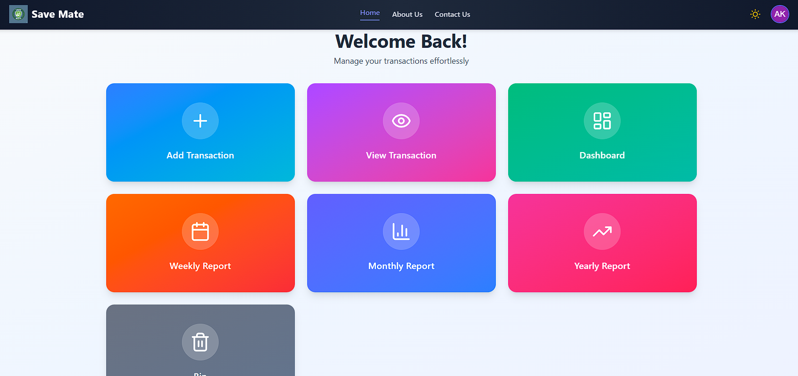
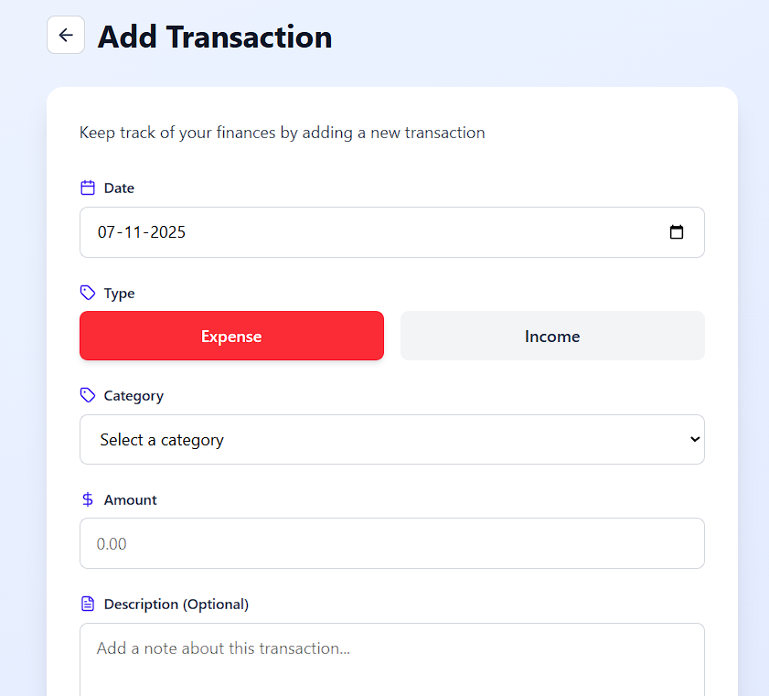
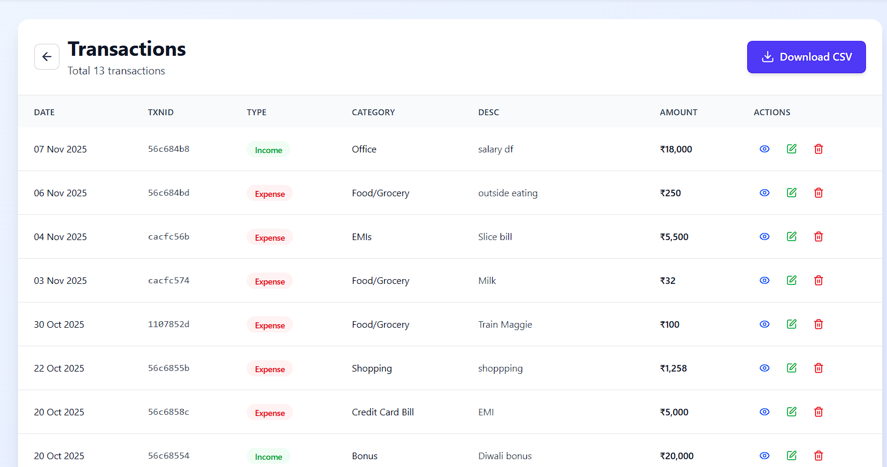
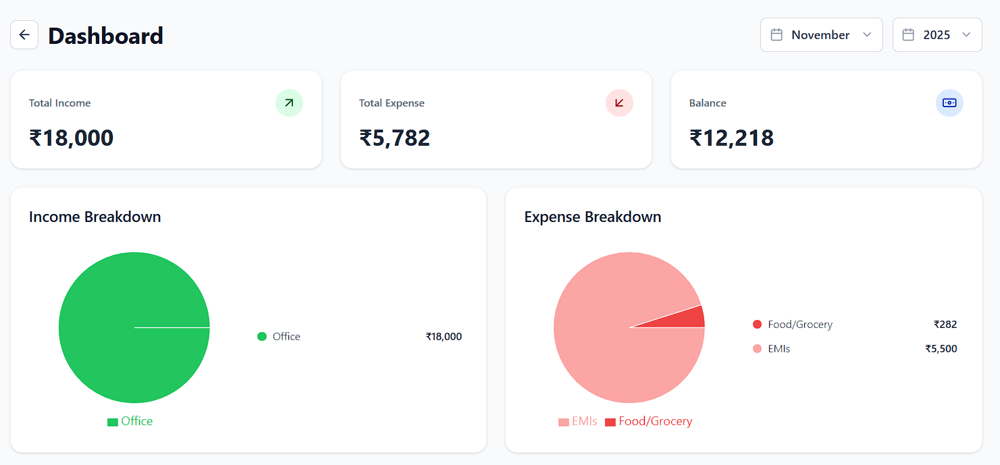
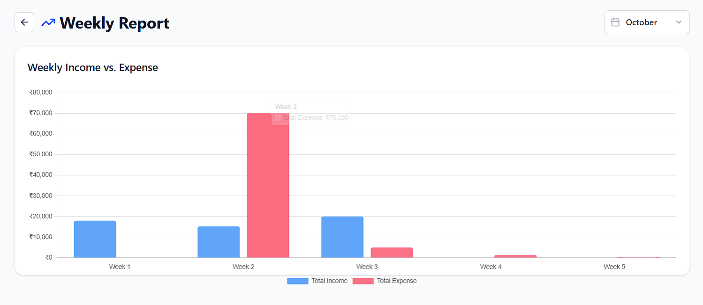
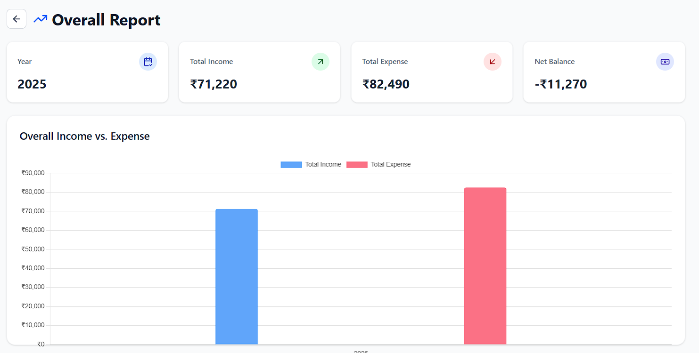
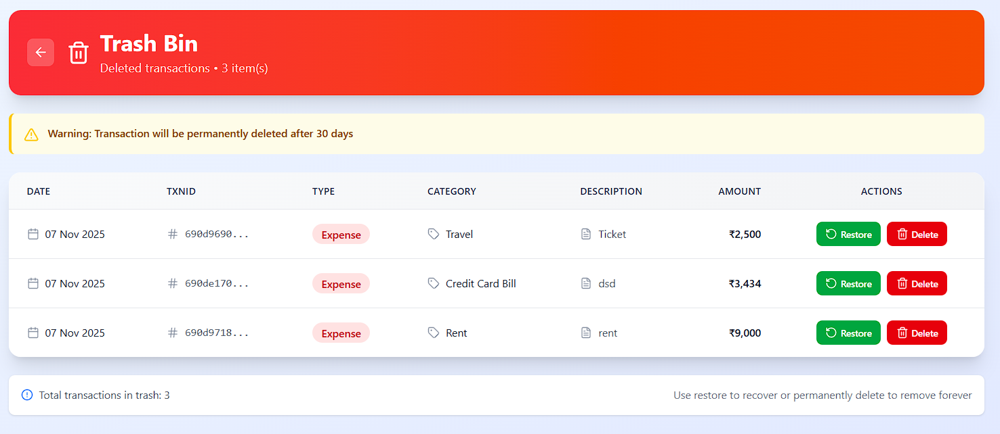

# Save Mate: Savings Calculator 💰

Save Mate is a user-friendly application designed to help you plan, track, and reach your financial goals. This simple savings calculator provides clear projections to empower your financial decisions.

---

## 🔗 Quick Link

* **Live Demo:** [**Try Save Mate Live!**](https://save-mate-v1.netlify.app/)

---

## 📸 Screenshots

---

## ✨ Features

* **Goal-Based Calculation:** Determine the monthly or weekly savings needed to reach a specific target amount by a set date.
* **Time Calculation:** Calculate how long it will take to reach a savings goal based on your current contribution amount.

* **Responsive Design:** Fully functional and looks great on both desktop and mobile devices.
* **Simple Interface:** Clean and intuitive UI, making financial planning easy for everyone.

---

## 💻 Tech Stack

This project was built using the following technologies:

* **Frontend:** (e.g., React, HTML5, CSS3, JavaScript)
* **Backend:** (e.g., Node.js, Express.js)
* **Database:** (e.g., MongoDB)
* **Other Tools:** (e.g., Mongoose, etc.)

---

## 👤 Author

**Ankit Kumar**

* **GitHub:** [@Ankit3060](https://github.com/Ankit3060)
* **LinkedIn:** [@Ankit](https://www.linkedin.com/in/ankit-kumar-511b31229/)